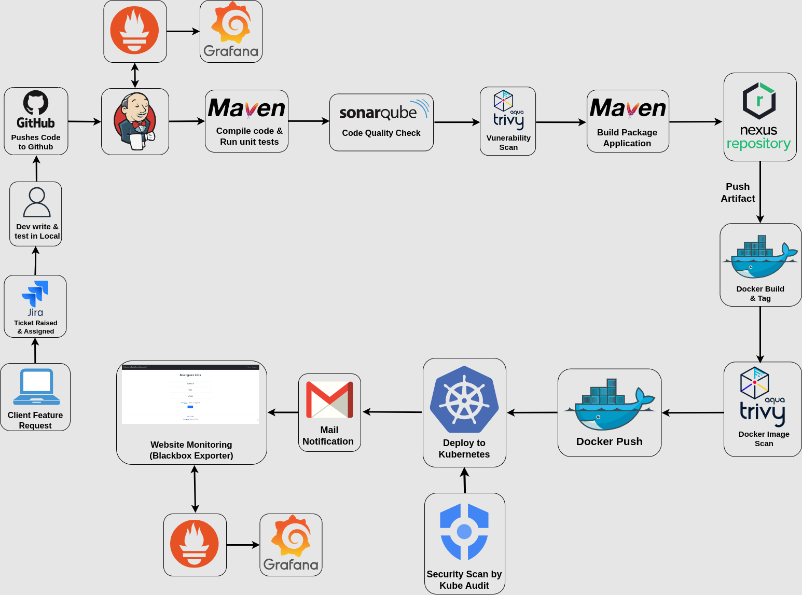

# End-to-End Secure CI/CD Project

This project showcases the implementation of a security-centric CI/CD pipeline, featuring code quality checks, vulnerability scanning, artifact publishing, secure Kubernetes deployment, and continuous monitoring.

## Key Principles

* **Security by Design:** Security considerations are integrated into every stage of the development and deployment process.
* **Automation:** The pipeline leverages automation to enhance efficiency, security, and reduce human error.
* **Continuous Monitoring:**  Systems and applications are continuously monitored to detect issues and anomalies promptly.

## Technologies Used

* **Kubernetes:** Container orchestration platform.
* **Jenkins:** CI/CD automation server.
* **SonarQube:** Code quality and static analysis.
* **Aqua Trivy:** Vulnerability scanning for code and container images.
* **Nexus Repository:** Artifact repository for secure storage.
* **Docker:** Containerization technology.
* **Docker Hub:** Docker image registry.
* **Kubeaudit:** Tool to audit Kubernetes clusters for various different security concerns.
* **Grafana**: For system and application-level monitoring and alerting.
* **Prometheus**: For collecting and querying metrics from services and endpoints.
* **Gmail**: For status notifications and alerts.

## Project Structure

* `config/`: Configuration files for Kubernetes, Jenkins, SonarQube, etc.
* `scripts/`:  Deployment and automation scripts.
* `src/`: Contains the source code of the demonstration application, Gcloud Infra and installation scripts, Kubernetes configuration files, etc.
* `terraform/` : Terraform configuration files.
* `Jenkinsfile`:  Declarative Jenkins pipeline definition.

## Workflow

1. **Development:**
   * Developers create feature branches and push code to GitHub.
2. **CI/CD Pipeline Trigger:**
   * Code changes trigger the Jenkins CI/CD pipeline.
3. **Build and Unit Testing:**
   * [Build tool] compiles the code and executes unit tests.
4. **Code Quality and Security:**
   * SonarQube performs code quality analysis.
   * Aqua Trivy scans for vulnerabilities in code dependencies.
5. **Artifact Creation:**
   * A build artifact (e.g., JAR, WAR) is generated.
6. **Artifact Publishing:**
   * The artifact is pushed to Nexus Repository.
7. **Container Image Build:**
   * Docker creates a container image using the artifact.
8. **Image Vulnerability Scan:**
   * Aqua Trivy scans the image for vulnerabilities.
9. **Deployment:**
   * If all checks pass, the image is deployed to Kubernetes.
10. **Monitoring and Notifications:**
    * Monitoring solutions track system and website health.
    * Emails are sent for deployment status and critical alerts.
