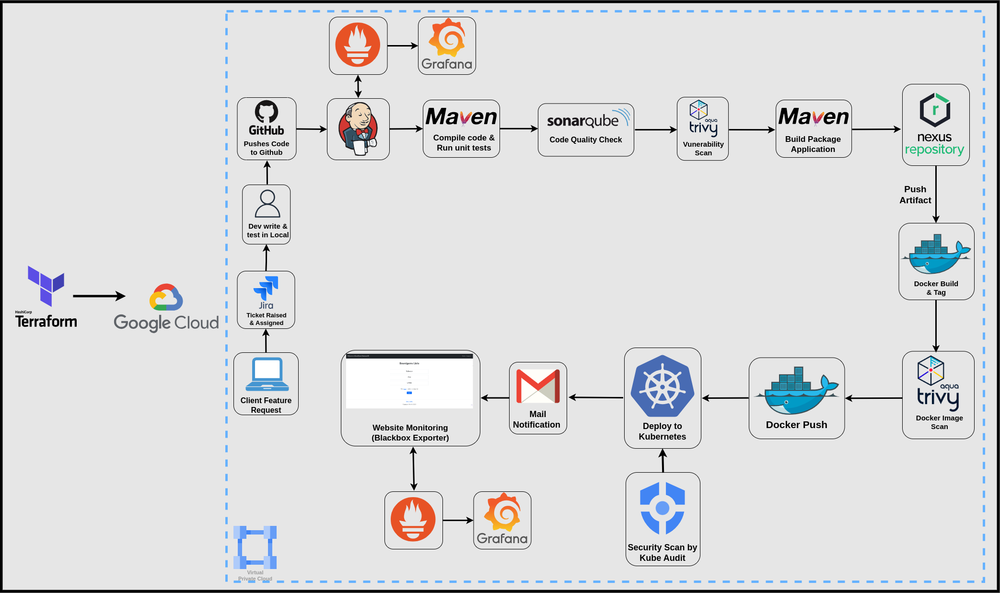
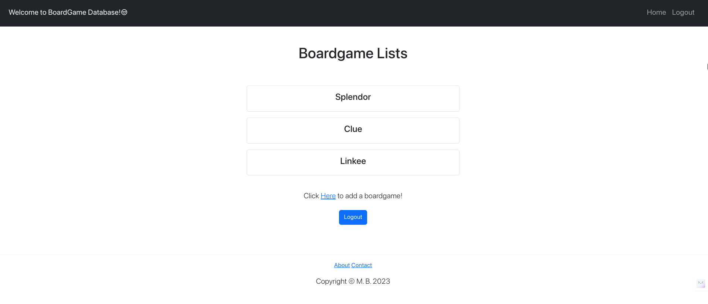
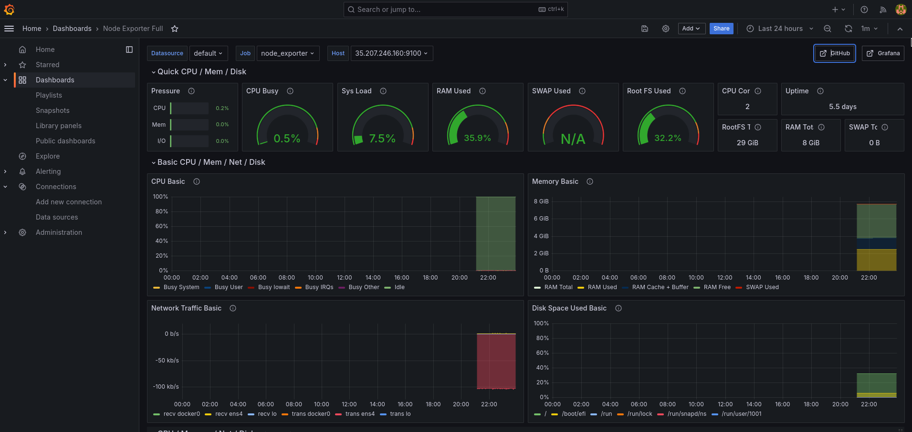
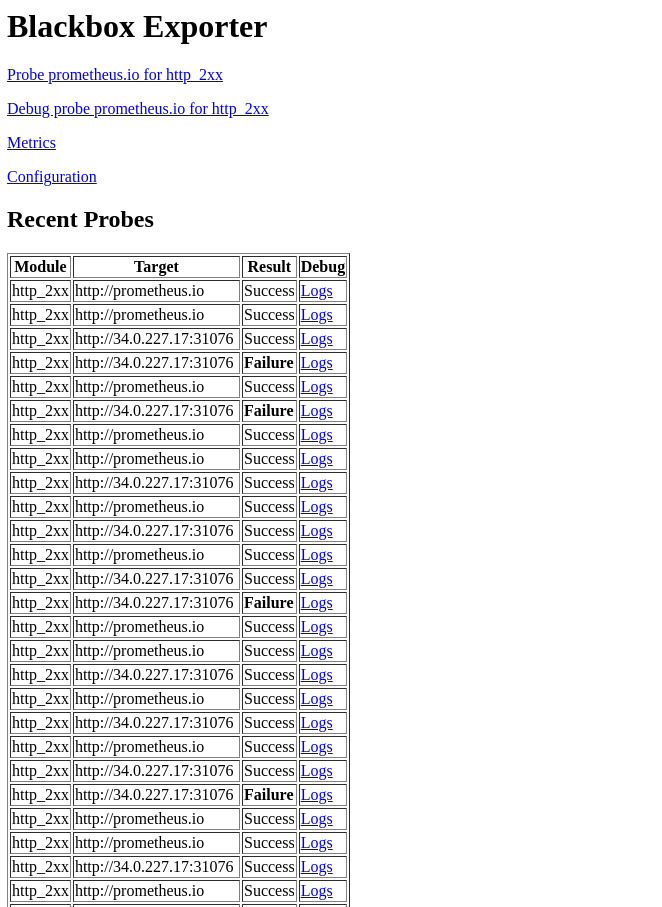
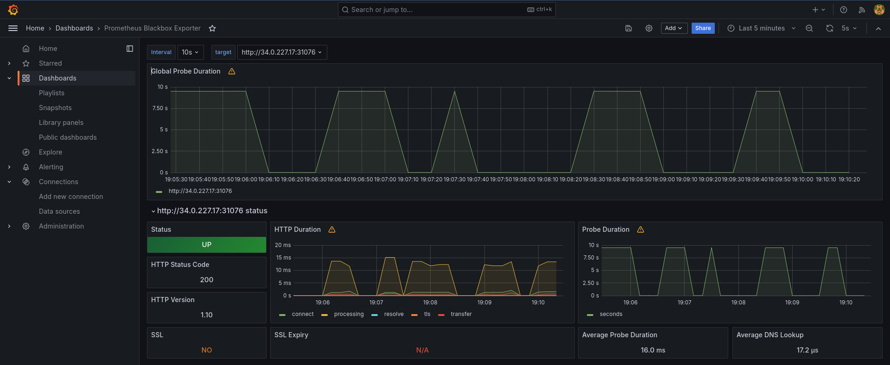

# End-to-End Secure Cloud Native CI/CD Pipeline

A security-centric CI/CD pipeline which integrates cutting-edge tools and practices to ensure robust code quality, vulnerability scanning, artifact publishing, secure Kubernetes deployment, and continuous monitoring.

## Table of Contents
- [Introduction](#introduction)
- [Technologies Used](#technologies-used)
- [Project Structure](#project-structure)
- [Workflow](#workflow)
- [Screenshots](#screenshots)
- [Getting Started](#getting-started)
- [Contributing](#contributing)
- [License](#license)


## Introduction

This project implements a comprehensive security-centric CI/CD pipeline designed for modern cloud-native applications. Built on Google Cloud Platform (GCP), it demonstrates enterprise-grade security practices and automation throughout the software development lifecycle.



### Key Features

* **Security by Design:** 
  - Multi-layer security scanning with Aqua Trivy and SonarQube
  - Kubernetes security auditing using Kubeaudit
  - Secure artifact storage with Nexus Repository
  - Automated vulnerability assessments at code and container levels

* **Automation First:** 
  - Fully automated pipeline using Jenkins
  - Infrastructure as Code with Terraform
  - Containerized deployments with Docker and Kubernetes
  - Automated quality gates and security checks

* **Comprehensive Monitoring:**  
  - Real-time system metrics with Prometheus
  - Visual dashboards through Grafana
  - Automated alerts via Gmail
  - Blackbox monitoring for external endpoint health

### Business Benefits
- Reduced security risks through automated scanning and continuous monitoring
- Faster time to market with automated deployment pipeline
- Improved code quality through automated testing and analysis
- Enhanced reliability with continuous monitoring and alerting

For a detailed walkthrough of the implementation, check out my [comprehensive blog post](https://blog.chetan-thapliyal.cloud/implementing-a-security-centric-cloud-native-cicd-pipeline-a-real-world-demonstration-using-terraform-and-gcp).


## Technologies Used

* **Kubernetes:** Container orchestration platform.
* **Jenkins:** CI/CD automation server.
* **SonarQube:** Code quality and static analysis.
* **Aqua Trivy:** Vulnerability scanning for code and container images.
* **Nexus Repository:** Artifact repository for secure storage.
* **Docker:** Containerization technology.
* **Docker Hub:** Docker image registry.
* **Kubeaudit:** Tool to audit Kubernetes clusters for various different security concerns.
* **Grafana**: For system and application-level monitoring and alerting.
* **Prometheus**: For collecting and querying metrics from services and endpoints.
* **Gmail**: For status notifications and alerts.


## Project Structure

* `config/`: Configuration files for Kubernetes, Jenkins, SonarQube, etc.
* `scripts/`:  Deployment and automation scripts.
* `src/`: Contains the source code of the demonstration application, Gcloud Infra and installation scripts, Kubernetes configuration files, etc.
* `terraform/` : Terraform configuration files.
* `Jenkinsfile`:  Declarative Jenkins pipeline definition.

## Workflow

1. **Development:**
   * Developers create feature branches and push code to GitHub.
2. **CI/CD Pipeline Trigger:**
   * Code changes trigger the Jenkins CI/CD pipeline.
3. **Build and Unit Testing:**
   * [Build tool] compiles the code and executes unit tests.
4. **Code Quality and Security:**
   * SonarQube performs code quality analysis.
   * Aqua Trivy scans for vulnerabilities in code dependencies.
5. **Artifact Creation:**
   * A build artifact (e.g., JAR, WAR) is generated.
6. **Artifact Publishing:**
   * The artifact is pushed to Nexus Repository.
7. **Container Image Build:**
   * Docker creates a container image using the artifact.
8. **Image Vulnerability Scan:**
   * Aqua Trivy scans the image for vulnerabilities.
9. **Deployment:**
   * If all checks pass, the image is deployed to Kubernetes.
10. **Monitoring and Notifications:**
    * Monitoring solutions track system and website health.
    * Emails are sent for deployment status and critical alerts.

### Proect Snippets





## Getting Started

### Prerequisites
- [Docker](https://www.docker.com/get-started)
- [Jenkins](https://www.jenkins.io/download/)
- [Terraform](https://www.terraform.io/downloads)

### Installation
1. Clone the repository:
   ```bash
   https://github.com/ChetanThapliyal/Secure-cloudNative-CI-CD-pipeline.git
   ```
2. Navigate to the project directory:
   ```bash
   cd Secure-cloudNative-CI-CD-pipeline
   ```
3. Follow the setup instructions for each component in the config/ directory.

## Contributing

Contributions are welcome! Please read the [contributing guidelines](CONTRIBUTING.md) first.

1. Fork the repository.
2. Create a new branch (`git checkout -b feature/your-feature`).
3. Commit your changes (`git commit -m 'Add some feature'`).
4. Push to the branch (`git push origin feature/your-feature`).
5. Open a [pull request](https://docs.github.com/en/pull-requests/collaborating-with-pull-requests/proposing-changes-to-your-work-with-pull-requests/about-pull-requests).

## License

This project is licensed under the MIT License - see the [LICENSE](LICENSE) file for details.
